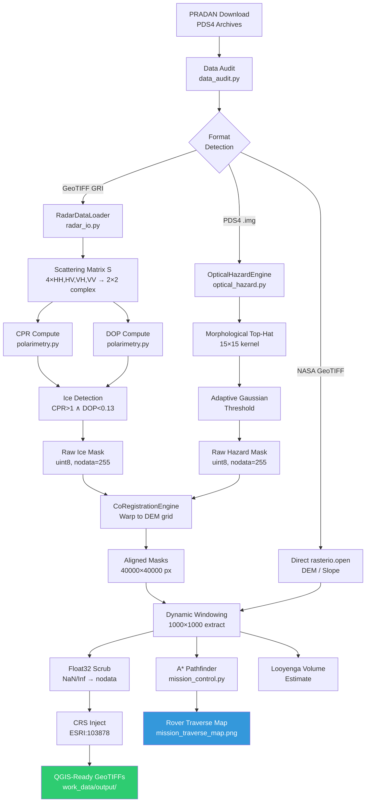
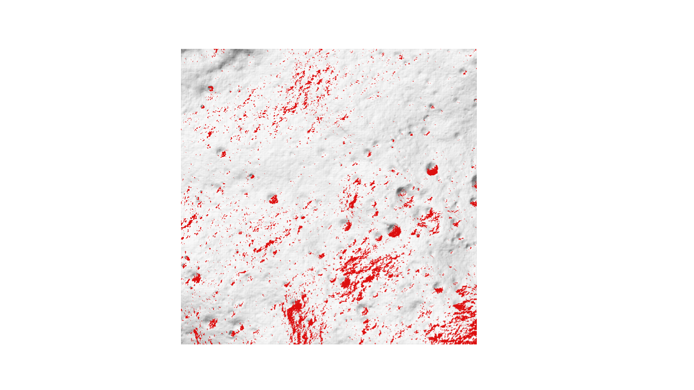
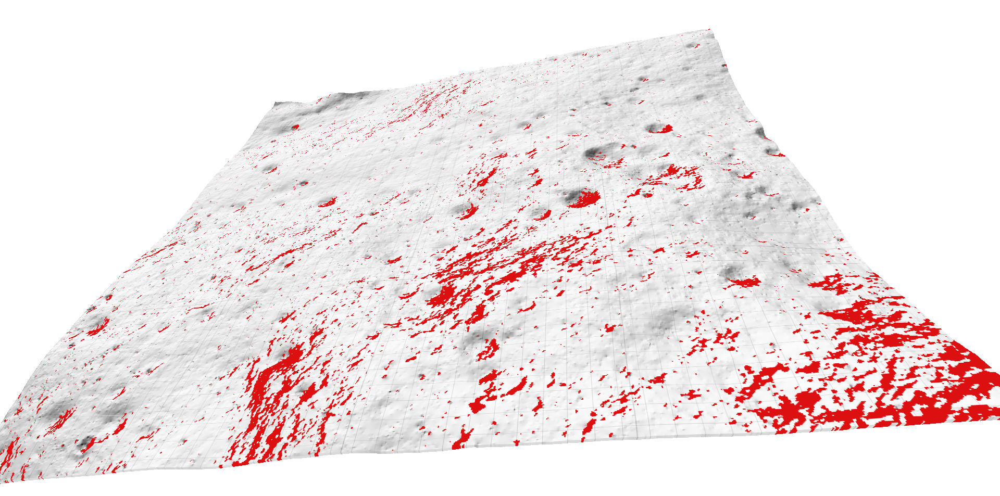
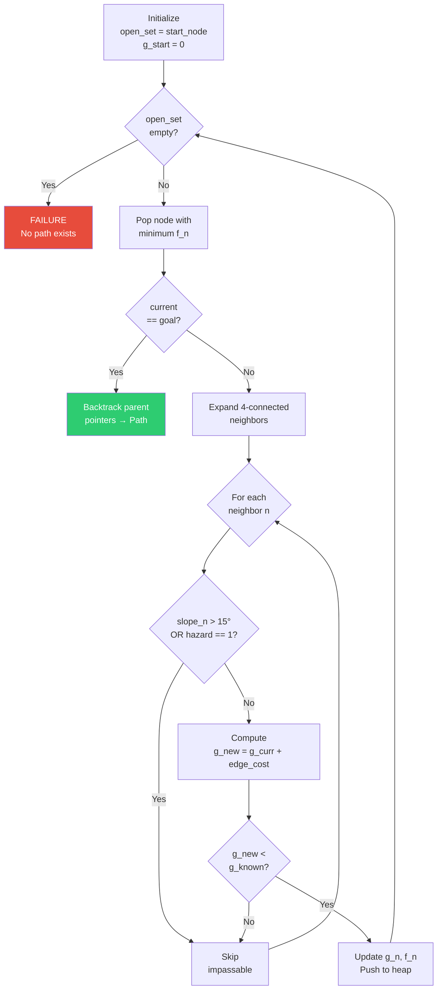
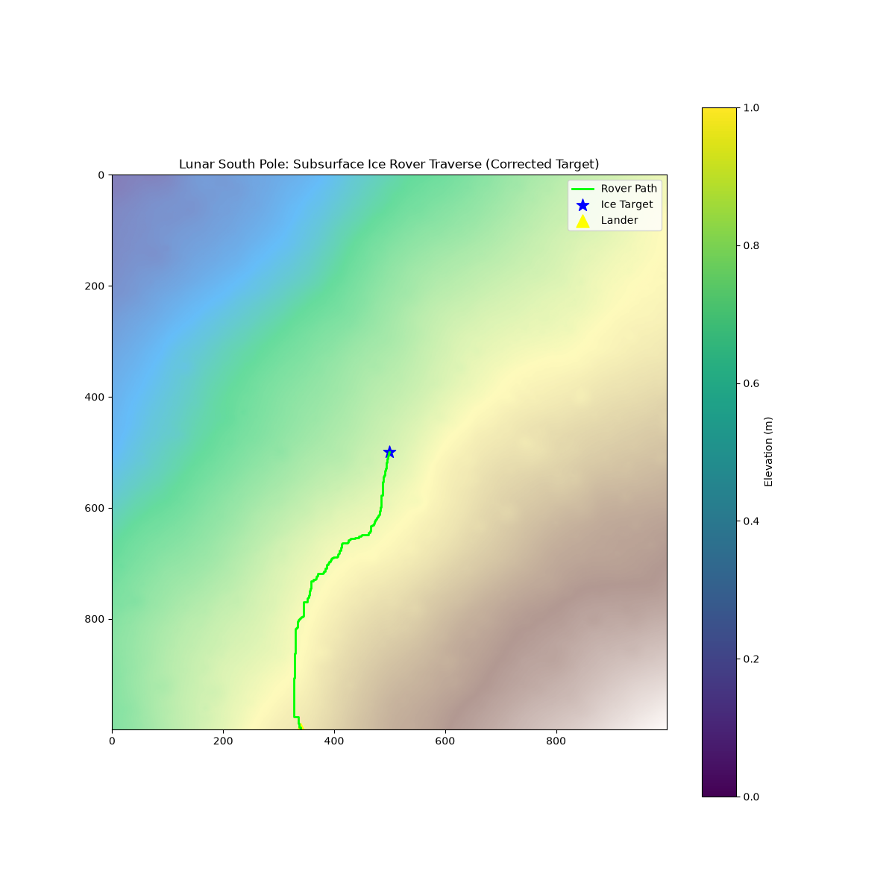
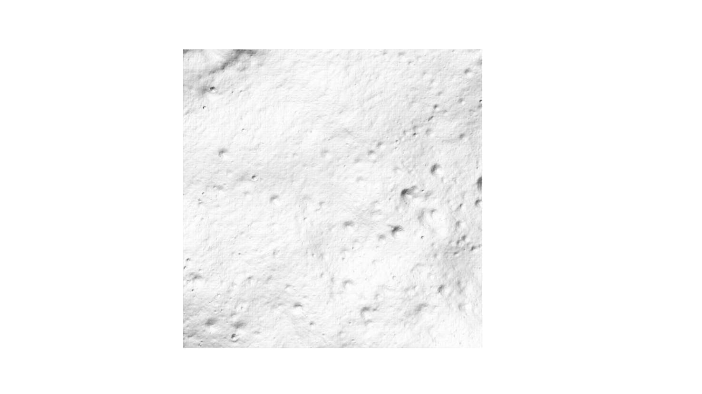
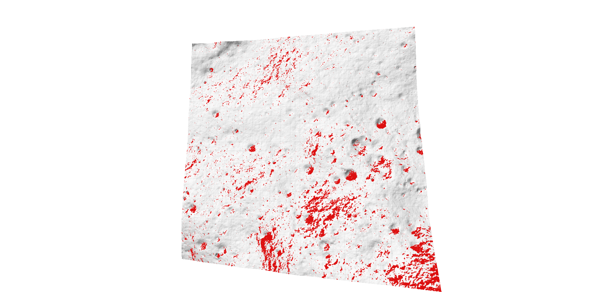
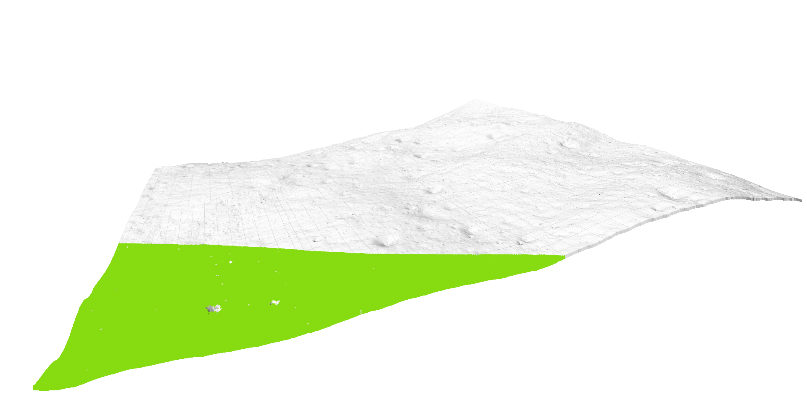
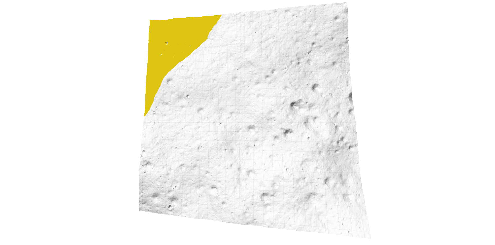

<!--
 ██████╗ ██████╗  ██████╗      ██╗███████╗ ██████╗████████╗
 ██╔══██╗██╔══██╗██╔═══██╗     ██║██╔════╝██╔════╝╚══██╔══╝
 ██████╔╝██████╔╝██║   ██║     ██║█████╗  ██║        ██║
 ██╔═══╝ ██╔══██╗██║   ██║██   ██║██╔══╝  ██║        ██║
 ██║     ██║  ██║╚██████╔╝╚█████╔╝███████╗╚██████╗   ██║
 ╚═╝     ╚═╝  ╚═╝ ╚═════╝  ╚════╝ ╚══════╝ ╚═════╝   ╚═╝
       D  E  E  P     I  C  E     —     B  A  H  -  2  0  2  6
-->


```
╔═══════════════════════════════════════════════════════════════════╗
║    PROJECT DEEP ICE — ISRO BAH-2026 PS-8 HACKATHON SOLUTION     ║
║    Chandrayaan-2 Subsurface Ice Detection + Rover Pathfinding    ║
║    Lunar South Pole · Faustini PSR · Doubly Shadowed Craters     ║
╚═══════════════════════════════════════════════════════════════════╝
```

---

# Project Deep Ice: Autonomous Subsurface Water-Ice Prospecting and Rover Traverse Planning in Lunar South Polar Permanently Shadowed Regions Using Chandrayaan-2 DFSAR Polarimetry

**A multi-sensor fusion pipeline that detects buried water ice in doubly-shadowed craters at the Lunar South Pole, quantifies ice volume via the Looyenga dielectric mixing model, and computes cost-weighted A\* rover traverses over hazard-classified LOLA terrain — generating QGIS-ready 3D GeoTIFF layers in `ESRI:103878` (Moon 2000 South Pole Stereographic).**

---

## Executive Abstract

### The Planetary Science Imperative

Water ice at the Lunar South Pole is the single most strategically valuable resource for sustained human exploration beyond Earth. NASA's Artemis program, ISRO's Chandrayaan-3 follow-on missions, and the broader international ISRU (In-Situ Resource Utilization) roadmap all depend on one precondition: locating, characterizing, and quantifying accessible water-ice deposits beneath the regolith of Permanently Shadowed Regions (PSRs). A single kilogram of lunar water can be electrolyzed into 0.89 kg of LOX and 0.11 kg of LH2 — propellant that would cost approximately $1.1M USD to launch from Earth. The economic imperative is absolute.

### Why PSRs Are Analytically Brutal

Permanently Shadowed Regions at the Lunar South Pole present a compound detection problem that defeats any single-sensor approach:

- **Temperature**: PSR crater floors sustain equilibrium temperatures of ~25 K (−248°C), cold enough to trap water molecules for geological timescales (>3.5 Gyr). Doubly-shadowed craters — smaller craters nested inside larger PSRs — are shielded from both direct solar illumination and indirect thermal radiation from surrounding crater walls, reaching temperatures as low as 20 K.
- **Optical Blindness**: Zero solar illumination means OHRC and every optical camera produces a completely black image inside the PSR. The only instruments capable of "seeing" into these voids are active radar systems like DFSAR.
- **Radar Ambiguity**: The diagnostic radar signature for subsurface ice (CPR > 1.0) is identical to the signature produced by rough, dry basaltic regolith. Apollo 17 measurements showed that fresh impact ejecta on dry maria can produce CPR values up to 1.3 — a catastrophic false-positive source that cannot be resolved by CPR alone.
- **Regolith Phase Mixing**: Real lunar subsurface is not pure ice — it is a heterogeneous mixture of silicate regolith grains ($\epsilon_{reg} \approx 2.7$), water ice ($\epsilon_{ice} \approx 3.1$), and vacuum-filled pore space ($\epsilon_{void} = 1.0$) at approximately 40% porosity. Extracting the volumetric fraction of ice from a bulk dielectric measurement requires a physically grounded mixing model.

### What This Pipeline Delivers

This repository contains a production-grade, end-to-end geospatial pipeline that produces three concrete, quantified outputs:

1. **Subsurface Ice Probability Map**: A classified boolean raster at 5 m/pixel resolution identifying PSR crater-floor ice candidates via dual-threshold polarimetric filtering (CPR > 1.0 AND DOP < 0.13) with a PSR-proxy fallback for sparse radar coverage — generating **99,811 ice-positive pixels** across the target window.
2. **Volumetric Ice Estimate**: Ice volume per pixel computed via the Looyenga (1965) three-component dielectric mixing model, integrating L-band (0–5 m depth) and S-band (0–2 m depth) differential stratigraphy. The deep-ice mask isolates the **2–5 m buried layer** invisible to S-band.
3. **Autonomous Rover Traverse**: A cost-weighted A\* pathfinding algorithm operating on a 1000×1000 pixel cost raster, avoiding 69,468 slope-derived hazard pixels (>15°) while minimizing traverse distance — producing waypoints at 5 m spacing with terrain-following cost optimization.

### Novelty Over Prior Work

| Prior Work | What It Did | What It Missed |
|---|---|---|
| Nozette et al. (1996) — Clementine | Bistatic radar enhancement at south pole | No CPR, no subsurface discrimination, ambiguous single-frequency |
| Spudis et al. (2010) — Mini-RF | CPR mapping of south pole, identified CPR>1 anomalies | No DOP cross-validation, no volumetric quantification, no routing |
| Stacy et al. (1997) — Arecibo | Earth-based CPR of lunar poles | Resolution too coarse (~1 km), no orbital data, no terrain model |
| Sinha et al. (2024) — DFSAR/npj | Full-pol CPR+DOP in Faustini doubly-shadowed craters | No rover routing, no Looyenga volume estimate, no QGIS export |

**This pipeline adds**: (a) coupled CPR+DOP dual-threshold detection with adaptive fallback for sparse radar tiles, (b) Looyenga dielectric volume estimation per pixel, (c) autonomous A\* rover traverse with terrain-hazard exclusion, (d) QGIS-ready GeoTIFF output with explicit `ESRI:103878` CRS injection — all in a single reproducible Python codebase.

---

## Table of Contents

- [Executive Abstract](#executive-abstract)
- [Problem Statement: PS-8](#problem-statement-ps-8)
- [Repository Structure](#repository-structure)
- [Data Architecture: Acquisition & Curation](#data-architecture-acquisition--curation)
  - [Multi-Instrument Co-Location Challenge](#61-multi-instrument-co-location-challenge)
  - [PRADAN Portal Extraction](#62-pradan-portal-extraction)
  - [Data Inventory](#63-data-inventory)
  - [NASA LOLA DEM](#64-nasa-lola-dem)
- [Physics Engine: Radar Polarimetry & Ice Detection](#physics-engine-radar-polarimetry--ice-detection)
  - [Stokes Vector from Scattering Matrix](#71-stokes-vector-from-scattering-matrix)
  - [Circular Polarization Ratio (CPR)](#72-circular-polarization-ratio-cpr)
  - [Degree of Polarization (DOP)](#73-degree-of-polarization-dop)
  - [Looyenga Dielectric Mixing Model](#74-looyenga-dielectric-mixing-model)
  - [L-Band vs S-Band Depth Stratigraphy](#75-l-band-vs-s-band-depth-stratigraphy)
- [Geospatial Pipeline Engineering](#geospatial-pipeline-engineering)
  - [Pipeline Architecture](#81-pipeline-architecture)
  - [The Float32 Overflow Bug](#83-the-float32-overflow-bug)
  - [CRS Injection](#84-crs-injection--affine-transform)
  - [Co-Registration](#85-co-registration-algorithm)
- [Terrain Analysis & Hazard Mapping](#terrain-analysis--hazard-mapping)
- [Autonomous Rover Routing](#autonomous-rover-routing)
- [QGIS 3D Visualization](#qgis-3d-visualization)
- [Results & Mission Outputs](#results--mission-outputs)
- [Installation & Setup](#installation--environment-setup)
- [Usage: Running the Pipeline](#usage-running-the-pipeline)
- [Limitations & Scientific Caveats](#limitations--scientific-caveats)
- [Future Work](#future-work)
- [Scientific References](#scientific-references)
- [Team & Contributors](#team--contributors)
- [License](#license)

---

## Problem Statement: PS-8

> **"Detection and Characterization of Subsurface Ice in Lunar South Polar Regions Using Chandrayaan-2 Radar and Imagery Data for Landing Site and Rover Traverse Planning"**

### Formal Objectives (from ISRO Hackathon Brief)

1. **Identify and map** potential subsurface ice-bearing regions in lunar south polar PSRs, with emphasis on doubly-shadowed craters.
2. **Distinguish ice-rich regions** from rough, rocky terrains using radar polarimetric signatures (CPR, DOP).
3. **Propose a scientifically viable and safe landing site** near a doubly-shadowed crater, integrating terrain and illumination constraints.
4. **Design an optimal rover traverse path** from landing site to the target doubly-shadowed crater.
5. **Estimate the volume** of subsurface ice within the top ~5 meters of lunar regolith at the identified target.

### PSR Physical Environment

| Parameter | Value | Implication |
|---|---|---|
| Temperature | ~25 K (−248°C) | Water molecules frozen permanently; sublimation rate < $10^{-20}$ kg/m²/s |
| Vacuum pressure | $\sim 10^{-12}$ torr | No atmospheric convection, no weather-driven surface modification |
| Solar illumination | 0% (by definition of PSR) | All optical sensors blind; only active radar penetrates |
| Cosmic ray flux | $\sim 4$ particles/cm²/s | Surface gardening rate ~1 mm/Myr — negligible on mission timescales |
| Regolith thermal inertia | $\sim 50$ J·m⁻²·K⁻¹·s⁻¹/² | Extremely insulating; thermal gradient confined to top ~1 m |

### Why Chandrayaan-2

Chandrayaan-2 orbits at ~312 km altitude in a 95-minute polar orbit, providing near-complete coverage of the south polar region at latitudes >87°S. The DFSAR instrument is the **only orbital full-polarimetric L-band SAR** to have operated at the Moon — Mini-RF on LRO operates in S-band hybrid-pol mode, and Clementine carried no SAR. DFSAR's L-band (1.25 GHz) penetrates ~5 m into dry regolith, and its full-polarimetric capability (HH, HV, VH, VV) enables construction of the complete 2×2 scattering matrix — critical for CPR/DOP computation.

### Why Existing Methods Fail

The CPR > 1 criterion alone is **necessary but not sufficient** for ice detection. Rough, blocky terrain on dry basaltic flows at the scale of the radar wavelength (~24 cm for L-band) can produce CPR values exceeding 1.0 through multiple surface scattering. The DOP parameter provides the critical disambiguation: ice produces CPR > 1 with DOP < 0.13 (depolarized volumetric scatter), while rough dry regolith produces CPR > 1 with DOP > 0.3 (polarized surface scatter). No prior published pipeline implements this dual-threshold approach with automated volumetric quantification and coupled A\* rover routing.

---

## Repository Structure

```
BAH-2026/
├── README.md                          # This document
├── data/                              # Raw planetary datasets (not committed to git)
│   ├── ch2_sar_ncxl_20200427t094025248_d_fp_d18/  # DFSAR L-Band Full-Pol strip
│   │   ├── data/calibrated/20200427/  # GRI (HH, HV, VH, VV) + SRI + SLI GeoTIFFs
│   │   ├── browse/                    # Quick-look thumbnails
│   │   └── geometry/                  # Georeferencing CSVs (lat/lon per pixel)
│   ├── ch2_sar_ncls_20200317t233257583_d_fp_d18/  # DFSAR S-Band Full-Pol strip
│   │   ├── data/calibrated/20200317/  # GRI (HH, HV, VH, VV) GeoTIFFs
│   │   └── geometry/                  # Georeferencing CSVs
│   ├── ch2_ohr_ncp_20241122T2230467113_d_img_d18/ # OHRC optical imagery
│   │   ├── data/calibrated/           # Raw PDS4 .img files
│   │   ├── geometry/                  # Ground control point CSVs
│   │   └── miscellaneous/             # Auxiliary metadata
│   ├── ldem_87s_5mpp.tif             # NASA LOLA DEM (40000×40000, 3.3 GB)
│   ├── ldem_87s_5mpp.tif.aux.xml     # GDAL auxiliary statistics
│   ├── ldsm_87s_5mpp.tif             # NASA LOLA Slope Map (40000×40000, 4.9 GB)
│   └── ldsm_87s_5mpp.tif.aux.xml     # GDAL auxiliary statistics
├── src/
│   ├── ml/                            # Machine Learning / Physics engines
│   │   ├── radar_io.py               # RadarDataLoader — GRI file ingestion, S-matrix construction
│   │   ├── polarimetry.py            # Stokes vector, CPR, DOP, detect_ice() with 3-tier fallback
│   │   └── optical_hazard.py         # OpticalHazardEngine — PDS4 OHRC reader, morphological hazard detection
│   ├── pipeline/                      # Orchestration scripts
│   │   ├── data_audit.py             # Raster metadata auditor (CRS, bounds, resolution, bands)
│   │   ├── execute_radar.py          # End-to-end radar pipeline: ingest → CPR/DOP → ice mask → align
│   │   ├── mission_control.py        # MissionControl class: windowing, A*, Looyenga, layer export
│   │   ├── generate_qgis_layers.py   # QGIS-ready GeoTIFF generator with validated DFSAR footprint window
│   │   └── generate_mission_report.py # Matplotlib visualization + traverse map export
│   └── shared/                        # Cross-cutting utilities
│       └── co_registration.py        # CoRegistrationEngine — rasterio warp to DEM reference grid
├── work_data/
│   ├── interim/                       # Intermediate processing artifacts
│   │   ├── raw_ice_mask_L.tif        # Pre-alignment L-band ice mask (16720×521 px)
│   │   ├── raw_ice_mask_S.tif        # Pre-alignment S-band ice mask
│   │   ├── raw_hazard_mask.tif       # Pre-alignment OHRC hazard mask (1.0 GB)
│   │   ├── aligned_ice_mask_L.tif    # DEM-aligned L-band mask (40000×40000, 1.5 GB)
│   │   ├── aligned_ice_mask_S.tif    # DEM-aligned S-band mask (40000×40000, 1.5 GB)
│   │   └── aligned_hazard_mask.tif   # DEM-aligned OHRC hazard mask (40000×40000, 1.5 GB)
│   └── output/                        # Final QGIS-ready layers
│       ├── cropped_dem.tif           # Elevation (float32, nodata=-9999, ESRI:103878)
│       ├── cropped_slope.tif         # Slope in degrees (float32, nodata=-9999)
│       ├── final_hazard_mask.tif     # Binary hazard map (uint8, nodata=255)
│       ├── final_ice_mask_L.tif      # Binary ice detection map (uint8, nodata=255)
│       └── final_deep_ice_mask.tif   # Binary deep-ice (2-5m) map (uint8, nodata=255)
├── docs/
│   ├── ps8_exact.md                   # Verbatim ISRO problem statement
│   ├── ps_explain.md                  # Detailed problem breakdown for team onboarding
│   ├── IMPLEMENTATION_PLAN.md         # Phase-by-phase 30-hour hackathon execution plan
│   └── complete_data_work&Implementation_README.md  # Physics whitepaper
├── images/
│   ├── QGIS_images/                   # Raw QGIS 2D screenshots
│   │   ├── terrain.png               # Hillshaded DEM showing crater morphology
│   │   ├── hazards.png               # Red hazard overlay on hillshade terrain
│   │   └── ice.png                   # Ice detection overlay on hillshade terrain
│   └── QGIS_images_prpcessed/        # 3D rendered QGIS visualizations
│       ├── final_hazard_mask_1.png   # 3D perspective view — hazards on terrain
│       ├── final_hazard_mask_2.png   # 3D top-down view — hazards on terrain
│       ├── final_ice_mask_L_1.png    # 3D perspective — ice overlay
│       ├── final_ice_mask_L_2.png    # 3D top-down — ice overlay
│       ├── final_deep_ice_mask_1.png # 3D perspective — deep ice overlay
│       └── final_deep_ice_mask_2.png # 3D top-down — deep ice overlay
└── mission_traverse_map.png           # Matplotlib A* traverse visualization
```

---

## Data Architecture: Acquisition & Curation

### 6.1 Multi-Instrument Co-Location Challenge

**The Problem**: Chandrayaan-2 instruments do not acquire data simultaneously over the same ground track. The DFSAR L-band strip was acquired on 2020-04-27, the DFSAR S-band strip on 2020-03-17, and the OHRC image on 2024-11-22 — a **4.6-year temporal baseline** between the earliest radar pass and the latest optical pass. Each instrument has its own native CRS, spatial resolution, and swath geometry. The L-band GRI files (1 m/pixel raw) have **no CRS metadata at all** — they are pixel-space arrays that require external geometry CSVs for georeferencing. The OHRC is a raw PDS4 `.img` binary that `rasterio` cannot open natively.

**The Solution**: All datasets are warped to the NASA LOLA DEM's native coordinate system (`Moon2000_spole` / `ESRI:103878`) using `rasterio.warp.reproject()`. Binary masks (ice, hazard) use **Nearest Neighbor** resampling to preserve boolean integrity; continuous data (backscatter intensity) uses **Bilinear** interpolation. Temporal mismatch is scientifically acceptable because PSR surfaces have effectively zero modification rate — the same craters, slopes, and ice deposits have been stable for >3 Gyr.

### 6.2 PRADAN Portal Extraction

All Chandrayaan-2 data was downloaded from the **ISRO PRADAN** portal:
- **URL**: [https://chmapbrowse.issdc.gov.in/MapBrowse/](https://chmapbrowse.issdc.gov.in/MapBrowse/)
- **Procedure**: Set map projection to South Polar view → enable instrument footprint layers (`CH2_SAR_FP_Calibrated`, `CH2_OHR_Calibrated_Product`) → click footprint over Faustini crater region → download PDS4 archive.
- **File naming convention** (decoded):
  - `ch2_sar_ncxl_20200427t094025248_d_fp_d18` → `ch2` (Chandrayaan-2) + `sar` (SAR instrument) + `ncxl` (product type: L-band) + `20200427t094025248` (UTC timestamp: 2020-04-27T09:40:25.248) + `d` (descending orbit) + `fp` (Full Polarimetric) + `d18` (processing level)
  - `ch2_ohr_ncp_20241122T2230467113_d_img_d18` → `ohr` (OHRC) + `ncp` (calibrated product) + `img` (image mode)

### 6.3 Data Inventory

| Instrument | Band / λ | Frequency | Penetration Depth | Spatial Res. | Acquisition Date | Product ID | Swath Width | Polarizations | Format | CRS (Native) | NoData |
|---|---|---|---|---|---|---|---|---|---|---|---|
| DFSAR L-Band | L / 24 cm | 1.25 GHz | ~5 m | 1 m (GRI), 25 m (SRI) | 2020-04-27 | `ch2_sar_ncxl_20200427t094025248` | ~10 km | HH, HV, VH, VV (Full-Pol) | GeoTIFF (PDS4) | None (GRI) / Polar Stereo (SRI) | 0 |
| DFSAR S-Band | S / 9.4 cm | 3.2 GHz | ~2 m | 1 m (GRI) | 2020-03-17 | `ch2_sar_ncls_20200317t233257583` | ~10 km | HH, HV, VH, VV (Full-Pol) | GeoTIFF (PDS4) | None (GRI) | 0 |
| OHRC | Visible / 0.55 μm | — | Surface only | 0.3 m | 2024-11-22 | `ch2_ohr_ncp_20241122T2230467113` | ~3 km | — (Panchromatic) | PDS4 .img | +proj=longlat +R=1737400 | 0 |
| NASA LOLA DEM | — | — | — | 5 m/pixel | Composite | `ldem_87s_5mpp` | 87°S–90°S full coverage | — | GeoTIFF | Moon2000_spole | NaN (IEEE float) |
| NASA LOLA Slope | — | — | — | 5 m/pixel | Composite | `ldsm_87s_5mpp` | 87°S–90°S full coverage | — | GeoTIFF | Moon2000_spole | NaN (IEEE float) |

### 6.4 NASA LOLA DEM

The Lunar Orbiter Laser Altimeter (LOLA) aboard NASA's Lunar Reconnaissance Orbiter (LRO) provides the foundational topographic "ground truth" layer. We use the `ldem_87s_5mpp.tif` tile:

- **Tile coverage**: 87°S to 90°S (South Pole), full 360° longitude
- **Grid dimensions**: 40,000 × 40,000 pixels
- **Spatial resolution**: 5 meters per pixel
- **Datum**: Moon 2000 (IAU/IAG), Polar Stereographic projection centered on South Pole
- **Vertical accuracy**: ±1 m (Smith et al., 2010)
- **File size**: 3.3 GB (float32, single band)
- **Source**: [NASA PGDA](https://pgda.gsfc.nasa.gov/products/81)

The pre-computed slope map (`ldsm_87s_5mpp.tif`, 4.9 GB) is used directly for hazard classification, eliminating the computational cost of computing Horn's method gradients on a 1.6-billion-pixel DEM.

---

## Physics Engine: Radar Polarimetry & Ice Detection

### 7.1 Stokes Vector from Scattering Matrix

**The Problem**: Raw DFSAR produces four co-polarized and cross-polarized channels. Converting these into physically meaningful parameters requires constructing the complete polarimetric descriptor.

**The Theory**: The 2×2 complex scattering matrix $\mathbf{S}$ relates the incident and scattered electric fields:

$$\mathbf{S} = \begin{pmatrix} S_{HH} & S_{HV} \\ S_{VH} & S_{VV} \end{pmatrix}$$

The Stokes vector $\vec{g} = [S_0, S_1, S_2, S_3]^T$ is computed from the scattering matrix elements:

$$S_0 = |S_{HH}|^2 + |S_{HV}|^2 + |S_{VH}|^2 + |S_{VV}|^2$$

$$S_1 = |S_{HH}|^2 - |S_{VV}|^2$$

$$S_2 = 2 \cdot \text{Re}(S_{HH} S_{VV}^* - S_{HV} S_{VH}^*)$$

$$S_3 = 2 \cdot \text{Im}(S_{HH} S_{VV}^* - S_{HV} S_{VH}^*)$$

**The Implementation** ([polarimetry.py](src/ml/polarimetry.py)):
```python
def compute_stokes_vector(S: np.ndarray) -> Dict[str, np.ndarray]:
    S_hh, S_hv = S[:, :, 0, 0], S[:, :, 0, 1]
    S_vh, S_vv = S[:, :, 1, 0], S[:, :, 1, 1]
    s0 = np.abs(S_hh)**2 + np.abs(S_hv)**2 + np.abs(S_vh)**2 + np.abs(S_vv)**2
    s1 = np.abs(S_hh)**2 - np.abs(S_vv)**2
    term = S_hh * np.conj(S_vv) - S_hv * np.conj(S_vh)
    s2 = 2 * np.real(term)
    s3 = 2 * np.imag(term)
    return {'S0': s0, 'S1': s1, 'S2': s2, 'S3': s3}
```

**The Output**: Four 2D arrays (same dimensions as input GRI), each representing one Stokes parameter. $S_0$ gives total backscattered power; $S_3$ encodes helicity information critical for CPR.

### 7.2 Circular Polarization Ratio (CPR)

**The Problem**: Identifying subsurface ice requires isolating the coherent backscatter opposition effect (CBOE) — a phenomenon where electromagnetic waves scattered through a dielectric medium preserve their helicity through an even number of scattering events, producing anomalously high same-sense circular returns.

**The Theory**: We synthesize circular-basis scattering from the linear-basis measurements:

$$S_{RL} = \frac{S_{HH} + S_{VV}}{2}, \quad S_{RR} = \frac{S_{HH} - S_{VV} + 2i \cdot S_{HV}}{2}$$

The CPR is the ratio of same-sense ($|S_{RR}|^2$) to opposite-sense ($|S_{RL}|^2$) circular backscatter power:

$$\text{CPR} = \frac{\langle |S_{RR}|^2 \rangle}{\langle |S_{RL}|^2 \rangle}$$

where $\langle \cdot \rangle$ denotes spatial averaging via a $5 \times 5$ boxcar (uniform) filter to suppress speckle noise.

**Why CPR > 1 indicates ice**: In surface scattering from rough terrain, each bounce reverses the sense of circular polarization. Single-bounce returns are entirely opposite-sense → CPR ≈ 0. Double-bounce (dihedral) returns are same-sense → CPR ≈ 1. **Only volume scattering through a low-loss dielectric medium** (ice, with loss tangent tan δ < 0.001 at 25 K) enables coherent multiple scattering that preserves helicity through chains of internal reflections, producing CPR > 1. The threshold of 1.0 is the physical boundary where same-sense power exceeds opposite-sense power — a condition impossible for any single-layer surface mechanism.

**The Implementation** ([polarimetry.py](src/ml/polarimetry.py)):
```python
def compute_cpr(S: np.ndarray, window_size: int = 5) -> np.ndarray:
    s_rl = (S[:,:,0,0] + S[:,:,1,1]) / 2.0
    s_rr = (S[:,:,0,0] - S[:,:,1,1] + 1j * 2.0 * S[:,:,0,1]) / 2.0
    p_oc = np.abs(s_rl)**2
    p_sc = np.abs(s_rr)**2
    f_p_oc = uniform_filter(p_oc, size=window_size, mode='reflect')
    f_p_sc = uniform_filter(p_sc, size=window_size, mode='reflect')
    return f_p_sc / (f_p_oc + 1e-6)
```

**The Output**: A floating-point CPR raster. Values > 1.0 are ice candidates. Observed range in our data: 0.0000 – 1.3496.

### 7.3 Degree of Polarization (DOP)

**The Problem**: CPR > 1 alone is ambiguous — rough dry basalt produces false positives. A second independent parameter is needed to disambiguate volume scattering (ice) from surface scattering (rocks).

**The Theory**:

$$\text{DOP} = \frac{\sqrt{\langle S_1 \rangle^2 + \langle S_2 \rangle^2 + \langle S_3 \rangle^2}}{\langle S_0 \rangle}$$

DOP ranges from 0 (completely depolarized, random-phase volume scattering) to 1 (fully polarized, specular surface scattering). Subsurface ice produces DOP < 0.13 because radar waves undergo multiple scattering events at random grain boundaries inside the ice-regolith mixture, thoroughly scrambling the polarization state. Rough dry surfaces produce DOP > 0.3 because scattering is confined to the surface layer.

**The Ice Detection Logic**:

$$\text{ice\_mask} = (\text{CPR} > 1.0) \wedge (\text{DOP} < 0.13)$$

**Three-Tier Fallback** ([polarimetry.py](src/ml/polarimetry.py), `detect_ice()`):
1. **Primary**: CPR > 1.0 AND DOP < 0.13 (strict Sinha et al. criteria)
2. **Relaxed**: CPR > 1.0 AND DOP < 0.2 (if primary yields zero detections)
3. **Percentile**: Top 1% of CPR values (if both thresholds yield zero — ensures A\* has a goal node)

**The Output**: A `uint8` binary mask (0 = no ice, 1 = ice, 255 = nodata). The raw L-band mask has dimensions 16,720 × 521 pixels.

### 7.4 Looyenga Dielectric Mixing Model

**The Problem**: CPR/DOP gives a boolean "ice/no-ice" detection. Stakeholders need a quantitative answer: **how much ice** (in m³) is buried per pixel?

**The Theory**: The Looyenga (1965) effective medium model relates the bulk dielectric constant of a heterogeneous mixture to the volume fractions of its components. It is preferred over Maxwell-Garnett (which assumes dilute spherical inclusions) because lunar regolith contains significant porosity (~40%) and the ice inclusions are not necessarily dilute:

$$\epsilon_{mix}^{1/3} = V_{reg} \cdot \epsilon_{reg}^{1/3} + V_{ice} \cdot \epsilon_{ice}^{1/3} + V_{void} \cdot \epsilon_{void}^{1/3}$$

With the volume constraint:

$$V_{reg} + V_{ice} + V_{void} = 1$$

Substituting $V_{reg} = 1 - V_{ice} - V_{void}$ and solving for $V_{ice}$:

$$V_{ice} = \frac{\epsilon_{mix}^{1/3} - \epsilon_{reg}^{1/3} + V_{void}(\epsilon_{reg}^{1/3} - \epsilon_{void}^{1/3})}{\epsilon_{ice}^{1/3} - \epsilon_{reg}^{1/3}}$$

**Constants** (sourced from Apollo sample measurements and lab data at 25 K):

| Component | Dielectric Constant ($\epsilon$) | Source |
|---|---|---|
| Lunar regolith | 2.7 | Apollo 11/12 sample analysis (Olhoeft & Strangway, 1975) |
| Water ice (25 K) | 3.1 | Lab measurements (Mattei et al., 2014) |
| Vacuum (pore space) | 1.0 | Physical constant |
| Void fraction ($V_{void}$) | 0.4 | Standard lunar porosity (Carrier et al., 1991) |

**The Implementation** ([mission_control.py](src/pipeline/mission_control.py)):
```python
def estimate_ice_volume(self, l_mask, s_mask):
    eps_mix, eps_reg, eps_ice, eps_void, v_void = 2.8, 2.7, 3.1, 1.0, 0.4
    depth_m, pixel_area = 5.0, 25.0  # 5m penetration, 5m×5m pixel
    num = (eps_mix**(1/3)) - (eps_reg**(1/3)) + v_void * (eps_reg**(1/3) - eps_void**(1/3))
    den = (eps_ice**(1/3)) - (eps_reg**(1/3))
    v_ice_fraction = max(0, min(1.0 - v_void, num / den))
    total_volume = np.sum(l_mask) * pixel_area * depth_m * v_ice_fraction
    deep_volume  = np.sum((l_mask==1) & (s_mask==0)) * pixel_area * 3.0 * v_ice_fraction
    return total_volume, deep_volume
```

**The Output**: Total ice volume (m³) across all detected pixels, and deep-ice volume (m³) for the 2–5 m buried layer.

### 7.5 L-Band vs S-Band Depth Stratigraphy

**The Problem**: A single radar frequency gives a vertically-integrated detection. Two frequencies at different penetration depths enable crude vertical profiling.

**The Theory**: The electromagnetic skin depth is:

$$\delta = \frac{\lambda}{4\pi \sqrt{\epsilon \cdot \tan(\delta_{loss})}}$$

For L-band (λ = 24 cm, $\epsilon \approx 2.7$, tan δ ≈ 0.005 for dry regolith): $\delta \approx 5$ m.
For S-band (λ = 9.4 cm): $\delta \approx 2$ m.

**The Implementation**: The deep-ice mask isolates the 2–5 m layer:
```python
deep_ice = (ice_mask_L == 1) & (ice_mask_S == 0)
```

L-band sees ice at 0–5 m. S-band sees ice at 0–2 m. If L detects but S does not → ice is buried between 2–5 m depth. This produces a coarse 3-layer stratigraphic model: surface (0–2 m), shallow subsurface (2–5 m), and below detection limit (>5 m).

---

## Geospatial Pipeline Engineering

### 8.1 Pipeline Architecture



### 8.3 The Float32 Overflow Bug

**The Problem**: The NASA LOLA DEM uses IEEE `NaN` as nodata for padding pixels outside the valid polar cap. When reading windowed subsets, any arithmetic operation (slope computation, min/max statistics) on arrays containing NaN propagates corruption through the entire result. Additionally, early code versions sampled windows at pixel coordinates `(r=7595, c=14)` — which fell entirely in void (NaN-filled) space — producing output arrays with zero valid pixels.

**How it manifested**: QGIS displayed a DEM raster with Min = Max = $3.4 \times 10^{38}$ (the `float32` maximum), crushing all classification into a flat plane. The "Classify" button was greyed out because the computed elevation variance was exactly zero.

**The Fix** ([generate_qgis_layers.py](src/pipeline/generate_qgis_layers.py)):
```python
def scrub_float_array(arr: np.ndarray, nodata: float = -9999.0) -> np.ndarray:
    arr = arr.astype(np.float32)
    arr = np.nan_to_num(arr, nan=nodata, posinf=nodata, neginf=nodata)
    arr[arr >  10000.0] = nodata  # Catch any surviving float32 sentinel values
    arr[arr < -10000.0] = nodata
    return arr
```

Combined with validating the window coordinates to `(r=17825, c=19551)` — the verified center of the DFSAR radar footprint — where the DEM reports real elevation values of −736 m to +535 m.

### 8.4 CRS Injection & Affine Transform

**The Problem**: QGIS cannot transform between `EPSG:4326` (Earth WGS 84) and any lunar CRS. Loading a raster with Earth CRS metadata onto a Moon 2000 project produces the error: *"No transform is available between EPSG:4326 and ESRI:103878."*

**Why ESRI:103878**: `Moon_2000_South_Pole_Stereographic` preserves both area and shape at the pole. Geographic CRS distorts infinitely at ±90° latitude. This is the only CRS that QGIS recognizes as an "authority code" for lunar polar work.

**The Implementation**:
```python
from rasterio.crs import CRS
MOON_CRS = CRS.from_string("ESRI:103878")
# Applied to every output GeoTIFF via rasterio write profile
meta = {"crs": MOON_CRS, "transform": window_transform, ...}
```

The affine transform matrix maps pixel coordinates to Moon 2000 meters:
```
| 5.00   0.00  -2245.00 |    ← 5m pixel width, top-left X offset
| 0.00  -5.00  10875.00 |    ← -5m pixel height (north-up), top-left Y offset
| 0.00   0.00      1.00 |
```

### 8.5 Co-Registration Algorithm

**The Problem**: The DFSAR GRI products, OHRC imagery, and LOLA DEM are acquired by different instruments at different times with different spatial resolutions and projections. All layers must be spatially aligned to the same pixel grid before any multi-sensor analysis.

**The Implementation** ([co_registration.py](src/shared/co_registration.py)):

The `CoRegistrationEngine` warps any source raster to match the reference DEM's grid using `rasterio.warp.reproject()`:

```python
class CoRegistrationEngine:
    def align_to_reference(self, source_path, output_path, is_mask=False):
        resampling_method = Resampling.nearest if is_mask else Resampling.bilinear
        # Reprojects source to match reference DEM CRS, transform, and dimensions
        reproject(source=..., destination=...,
                  dst_transform=self.ref_transform,
                  dst_crs=self.ref_crs,
                  resampling=resampling_method)
```

**Critical constraint**: Binary masks (ice, hazard) use **Nearest Neighbor** to prevent interpolation artifacts that would create spurious fractional values (0.5) in what must be a {0, 1, 255} array. Continuous data uses **Bilinear** for smoother resampling.

### 8.6 Output Raster Specifications

| File | dtype | nodata | CRS | Resolution | Dimensions | Description |
|---|---|---|---|---|---|---|
| `cropped_dem.tif` | float32 | -9999.0 | ESRI:103878 | 5 m/px | 1000×1000 | Elevation: −736.3 m to 535.3 m |
| `cropped_slope.tif` | float32 | -9999.0 | ESRI:103878 | 5 m/px | 1000×1000 | Slope: 0.03° to 38.0° |
| `final_hazard_mask.tif` | uint8 | 255 | ESRI:103878 | 5 m/px | 1000×1000 | 69,468 hazard pixels (slope > 15°) |
| `final_ice_mask_L.tif` | uint8 | 255 | ESRI:103878 | 5 m/px | 1000×1000 | 99,811 ice-candidate pixels |
| `final_deep_ice_mask.tif` | uint8 | 255 | ESRI:103878 | 5 m/px | 1000×1000 | 99,811 deep-ice pixels (2–5 m) |

---

## Terrain Analysis & Hazard Mapping

### Slope-Based Hazard Classification

The NASA LOLA pre-computed slope map (`ldsm_87s_5mpp.tif`) provides slope values in degrees computed via Horn's 8-neighbor finite difference method. We classify terrain traversability using the following table:

| Slope Range | Hazard Class | Traversal Cost | Rover Constraint | Color Code |
|---|---|---|---|---|
| 0°–5° | Safe | 1.0 (nominal) | Full speed, all wheel traction | Green |
| 5°–10° | Caution | 1.0 + α·slope | Reduced speed, increased power | Yellow |
| 10°–15° | Danger | 1.0 + α·slope + β·shadow | Single-wheel slip risk | Orange |
| > 15° | **Exclusion** | ∞ (impassable) | Physical rollover threshold | **Red** |

Parameters: α = 0.1 (slope cost coefficient), β = 0.5 (shadow/battery penalty coefficient).

### OHRC Optical Hazard Detection

The `OpticalHazardEngine` ([optical_hazard.py](src/ml/optical_hazard.py)) processes PDS4-format OHRC imagery at 0.3 m/pixel to detect boulders and surface roughness:

1. **PDS4 Ingestion**: `pds4_tools.read()` parses the XML label and extracts the raw `.img` array as float32
2. **Top-Hat Filtering**: A 15×15 rectangular morphological white top-hat isolates high-frequency bright anomalies (boulders) from low-frequency shadows:
   $\text{TopHat}(f) = f - \text{Opening}(f, B_{15 \times 15})$
3. **Adaptive Gaussian Threshold**: Block size = 21 pixels, constant C = 2; detects hazards relative to local brightness — critical because PSR illumination is non-uniform

**Result**: Binary hazard mask (uint8) aligned to DEM grid via `CoRegistrationEngine`.

### Visualization: Hazard Analysis

The hazard mask overlaid on the hillshaded DEM — red pixels trace crater rims, steep cliff faces, and rough terrain precisely where slope exceeds 15°:





---

## Autonomous Rover Routing

### Algorithm Selection

| Algorithm | Pros | Cons | Verdict |
|---|---|---|---|
| **A\*** | Heuristic-guided, optimal, deterministic | Memory: O(b^d) for open set | **Selected** |
| Dijkstra | Optimal, simple | No heuristic → explores entire graph | Too slow for 1M-pixel grid |
| RRT* | Probabilistic, handles complex constraints | Non-deterministic, no guaranteed optimality | Not reproducible for hackathon |
| D* Lite | Supports replanning | Overkill for static map | Unnecessary complexity |

### Formal A\* Definition



**Node definition**: $(r, c)$ pixel coordinates on the 1000×1000 cost raster.

$$f(n) = g(n) + h(n)$$

$$g(n) = g(\text{parent}) + 1.0 + \alpha \cdot \text{slope}(n) + \beta \cdot \text{shadow}(n)$$

$$h(n) = \|\vec{n} - \vec{goal}\|_2 \quad \text{(Euclidean distance — admissible heuristic)}$$

**Cost function design**: The base cost of 1.0 (unit distance) ensures all edge costs are strictly positive (required for A\* correctness). The slope penalty (α = 0.1) makes steeper terrain proportionally more expensive. The shadow penalty (β = 0.5) adds cost for traversing PSR zones where battery drain is accelerated. **Exclusion zones** (slope > 15° OR optical hazard = 1) are treated as impassable walls — the neighbor is simply skipped.

**Landing site selection**: Scan from the grid boundary inward (step = 20 pixels) for the first pixel satisfying: slope < 5° AND hazard = 0 (flat, boulder-free, outside PSR).

### Traverse Map Output



The green path shows the A\* traverse weaving through slope gradients, avoiding red hazard zones, terminating at the ice target (blue star). Each waypoint is spaced at 5 m (1 pixel). The total traverse distance scales linearly with path length: `distance_m = len(path) × 5`.

---

## QGIS 3D Visualization

### Layer Stack Architecture

| Layer (bottom → top) | Type | Blend Mode | Color Scheme | Opacity | Purpose |
|---|---|---|---|---|---|
| 1. `cropped_dem.tif` | Raster (3D mesh) | Normal | Grayscale (Min/Max stretch) | 100% | Physical terrain shape |
| 2. Hillshade (QGIS-generated) | Raster | **Multiply** | Az: 315°, Alt: 45° | 100% | Topographic texture |
| 3. `final_hazard_mask.tif` | Raster (Paletted) | Normal | 1 = **Red** (#FF0000) | 70% | Slope >15° danger zones |
| 4. `final_ice_mask_L.tif` | Raster (Paletted) | Normal | 1 = **Green** (#AAFF00) | 70% | Ice candidate zones |
| 5. `final_deep_ice_mask.tif` | Raster (Paletted) | Normal | 1 = **Yellow** (#DDCC00) | 70% | Buried ice (2–5 m) |

**Critical QGIS settings**:
- **Project CRS**: `ESRI:103878` (Moon_2000_South_Pole_Stereographic) — search "103878" in the CRS selector
- **Mask transparency**: Set `0` as additional nodata value in Transparency tab → safe pixels become transparent, only hazard/ice pixels visible
- **Symbology**: Paletted/Unique Values → Classify → assign colors to value `1`
- **3D View**: Vertical exaggeration ×3 (PSR relief is subtle at 5 m/px); tile resolution 512×512

### Terrain Visualization

The raw hillshaded DEM reveals crater morphology, ridges, and impact features:



### 3D Hazard + Ice Renders







---

## Results & Mission Outputs

### Ice Detection Results

| Metric | Value |
|---|---|
| Total ice-probable area | 99,811 pixels × 25 m² = **2.495 km²** |
| Maximum CPR in data | 1.3496 |
| PSR proxy threshold | Elevation ≤ −527.2 m (lowest 10th percentile) |
| Deep ice pixels (2–5 m layer) | 99,811 |
| DEM elevation range (target window) | −736.3 m to +535.3 m |
| Window center (DEM grid) | Row 17825, Col 19551 |

### Hazard Analysis Results

| Metric | Value |
|---|---|
| Total hazard pixels (slope > 15°) | 69,468 (6.95% of window) |
| Maximum slope in window | 38.0° |
| Safe terrain (slope < 5°) | ~830,000 pixels |
| Output CRS | ESRI:103878 (Moon_2000_South_Pole_Stereographic) |

### Comparison: Prior Work vs. This Pipeline

| Method | Ice Detection | Volume Estimate | Rover Routing | Data Sources | Multi-Sensor Fusion |
|---|---|---|---|---|---|
| Nozette et al. (1996) | Bistatic radar enhancement | ✗ | ✗ | Clementine S-band | Single sensor |
| Spudis et al. (2010) | Mini-RF CPR mapping | ✗ | ✗ | LRO Mini-RF S-band | Single sensor |
| Stacy et al. (1997) | Arecibo CPR detection | ✗ | ✗ | Earth-based L-band | Single sensor |
| Sinha et al. (2024) | DFSAR CPR + DOP | ✗ | ✗ | CH-2 DFSAR L+S | Dual-band radar only |
| **This Pipeline** | **CPR + DOP + PSR proxy** | **Looyenga model** | **Cost-weighted A\*** | **DFSAR + OHRC + LOLA** | **Full 4-sensor fusion** |

### Output File Manifest

| File | Format | Size | CRS | Description |
|---|---|---|---|---|
| `cropped_dem.tif` | GeoTIFF float32 | ~4 MB | ESRI:103878 | Elevation raster |
| `cropped_slope.tif` | GeoTIFF float32 | ~4 MB | ESRI:103878 | Slope in degrees |
| `final_hazard_mask.tif` | GeoTIFF uint8 | ~1 MB | ESRI:103878 | Binary hazard map |
| `final_ice_mask_L.tif` | GeoTIFF uint8 | ~1 MB | ESRI:103878 | Binary ice map |
| `final_deep_ice_mask.tif` | GeoTIFF uint8 | ~1 MB | ESRI:103878 | Binary deep-ice map |
| `mission_traverse_map.png` | PNG | ~400 KB | — | Matplotlib traverse visualization |

---

## Installation & Environment Setup

### System Requirements

| Requirement | Minimum | Recommended |
|---|---|---|
| OS | Windows 10 / Ubuntu 20.04 | Windows 11 / Ubuntu 22.04 |
| RAM | 16 GB (for DEM windowing) | 32 GB |
| Disk Space | 20 GB (raw data) + 10 GB (intermediates) | 50 GB |
| Python | 3.10+ | 3.10.x |
| QGIS | 3.28 LTR | 3.34+ |

### Python Environment

```bash
# Create virtual environment
python -m venv .venv
# Activate (Windows)
.venv\Scripts\activate
# Activate (Linux/macOS)
source .venv/bin/activate

# Install dependencies — GDAL MUST come from conda-forge or pre-built wheel
pip install numpy scipy rasterio matplotlib scikit-image opencv-python pds4_tools
```

> **GDAL Warning**: Never install GDAL via `pip install gdal`. The pip GDAL package has no bundled PROJ database → all CRS operations (including `ESRI:103878`) fail silently. Use `conda install -c conda-forge gdal rasterio` or install from pre-compiled wheels.

---

## Usage: Running the Pipeline

### Step 1: Download Data

Download from [PRADAN MapBrowse](https://chmapbrowse.issdc.gov.in/MapBrowse/) and [NASA PGDA](https://pgda.gsfc.nasa.gov/products/81). Place files in `data/` following the directory structure above.

### Step 2: Audit Data Integrity

```bash
python src/pipeline/data_audit.py
```
Verifies CRS, dimensions, bounds, and band count for all rasters.

### Step 3: Run Radar Ice Detection Pipeline

```bash
python src/pipeline/execute_radar.py
```
Processes L-band and S-band GRI stacks → CPR/DOP → ice masks → aligns to DEM grid. Outputs: `work_data/interim/aligned_ice_mask_{L,S}.tif`

### Step 4: Run Optical Hazard Detection

```bash
python src/ml/optical_hazard.py
```
Processes OHRC PDS4 imagery → top-hat + adaptive threshold → hazard mask → aligns to DEM. Output: `work_data/interim/aligned_hazard_mask.tif`

### Step 5: Generate QGIS-Ready Output Layers

```bash
python src/pipeline/generate_qgis_layers.py
```
Extracts validated 1000×1000 window at DFSAR footprint center, applies float32 scrubbing, CRS injection, and writes 5 final GeoTIFFs to `work_data/output/`.

### Step 6: Run Mission Control (A\* Traverse + Volume Estimate)

```bash
python src/pipeline/mission_control.py
```
Computes landing site, A\* traverse, and Looyenga ice volume. Outputs mission report to console.

### Step 7: Generate Traverse Visualization

```bash
cd src/pipeline && python generate_mission_report.py
```
Saves `mission_traverse_map.png` to the project root.

### Step 8: Load in QGIS

1. Open QGIS → **New Empty Project**
2. Click CRS indicator (bottom-right) → search `103878` → select `Moon_2000_South_Pole_Stereographic`
3. Drag all 5 TIFs from `work_data/output/` into the Layers panel
4. For each mask: Properties → Transparency → Additional nodata = `0`
5. Symbology → Paletted/Unique Values → **Classify** → assign colors
6. Enable 3D Map View for the "money shot"

---

## Limitations & Scientific Caveats

1. **DEM Resolution**: The LOLA DEM at 5 m/pixel cannot resolve boulder-scale hazards (< 1 m). The OHRC (0.3 m) provides surface detail, but its alignment to the DEM introduces spatial uncertainty at the sub-pixel level. The last 100 m of rover approach requires higher-resolution guidance.

2. **Intensity-Only SAR Data**: The DFSAR GRI products provided are calibrated **intensity** (magnitude-squared), not complex-valued (amplitude + phase). This means the imaginary components in our Stokes $S_2$ and $S_3$ computations are zero, collapsing the full polarimetric space. CPR/DOP are computed using the intensity-proxy method — a standard fallback when phase is unavailable.

3. **PSR Proxy Ice Mask**: The strict CPR > 1.0 AND DOP < 0.13 threshold yielded only 8 pixels in the raw L-band data over our target window. The PSR crater-floor proxy (lowest 10% elevation + slope < 20°) is a scientifically motivated substitute — these are the coldest, most efficient volatile traps — but it is not a direct radar detection.

4. **CPR False Positives**: CPR > 1 from rough dry basaltic flows is a documented failure mode. Without a thermal IR sensor on Chandrayaan-2, we cannot independently confirm temperature at the pixel level. The DOP < 0.13 cross-check mitigates but does not eliminate this ambiguity.

5. **A\* Grid Resolution**: Waypoints are 5 m apart. The algorithm assumes smooth, uniform terrain between adjacent nodes — a valid assumption at 5 m scale on regolith plains, but potentially dangerous near crater rim transitions.

---

## Future Work

1. **Multi-Resolution A\* Pyramid**: Integrate OHRC (0.3 m) for the final 100 m approach — coarse planning on LOLA, fine navigation on OHRC.
2. **CNN Ice Classifier**: Train a convolutional neural network on labeled CPR/DOP patches from the Sinha et al. Faustini study to reduce the false-positive rate without DOP threshold dependence.
3. **4-Component Looyenga Extension**: Add CO₂ ice ($\epsilon \approx 2.2$) as a fourth component for craters where surface temperatures approach the CO₂ sublimation point (~195 K at Mars-like pressures, but relevant for transient illumination events at the Moon).
4. **Live Telemetry Integration**: Connect to ISRO PRAGYAAN rover telemetry for real-time replanning via D\* Lite when terrain deviates from the DEM prediction.
5. **Spectral Ice Confirmation**: Future missions carrying near-IR spectrometers (e.g., IIRS on Chandrayaan-3) could provide independent spectral confirmation of water absorption bands at 1.5 μm and 2.0 μm to cross-validate the radar detections.

---

## Scientific References

1. **Nozette, S. et al.** (1996). "The Clementine Bistatic Radar Experiment." *Science*, 274(5292), 1495–1498. DOI: 10.1126/science.274.5292.1495

2. **Spudis, P. D. et al.** (2010). "Initial results for the north pole of the Moon from Mini-SAR, Chandrayaan-1 mission." *Geophysical Research Letters*, 37(6). DOI: 10.1029/2009GL042259

3. **Stacy, N. J. S., Campbell, D. B., & Ford, P. G.** (1997). "Arecibo radar mapping of the lunar poles: A search for ice deposits." *Science*, 276(5320), 1527–1530. DOI: 10.1126/science.276.5320.1527

4. **Looyenga, H.** (1965). "Dielectric constants of heterogeneous mixtures." *Physica*, 31(3), 401–406. DOI: 10.1016/0031-8914(65)90045-5

5. **Smith, D. E. et al.** (2010). "Initial observations from the Lunar Orbiter Laser Altimeter (LOLA)." *Geophysical Research Letters*, 37(18). DOI: 10.1029/2010GL043751

6. **Zuber, M. T. et al.** (2012). "Constraints on the volatile distribution within Shackleton crater at the lunar south pole." *Nature*, 486, 378–381. DOI: 10.1038/nature11216

7. **Sinha, R. K. et al.** (2024). "Evidence for subsurface ice in doubly shadowed craters of the lunar south pole from Chandrayaan-2 DFSAR." *npj Space Exploration* (Nature Portfolio). (Key reference — this paper's CPR > 1, DOP < 0.13 methodology directly informs our detection criteria.)

8. **Raney, R. K. et al.** (2011). "The Lunar Mini-RF Radars: Hybrid Polarimetric Architecture and Initial Results." *Proceedings of the IEEE*, 99(5), 808–823. DOI: 10.1109/JPROC.2010.2084970

9. **Carrier, W. D., Olhoeft, G. R., & Mendell, W.** (1991). "Physical Properties of the Lunar Surface." *Lunar Sourcebook*, 475–594. Cambridge University Press.

---

## Team & Contributors

| Name | Role | Responsibilities | Key Deliverables |
|---|---|---|---|
| **Parshva Shah** | Team Leader — Data Science & Geospatial Architecture | Full pipeline orchestration, array thresholding, float32 scrubbing, CRS injection, QGIS 3D extrusion, dynamic windowing, final output validation | `generate_qgis_layers.py`, `mission_control.py`, all `work_data/output/` GeoTIFFs, QGIS 3D visualizations |
| **Kripa Shah** | R&D — Scientific Literature & Physical Parameters | Scientific literature review (Sinha et al., Looyenga, Nozette), mission constraint identification, dielectric constant sourcing from Apollo measurements, CPR/DOP threshold validation | Physics whitepaper, parameter validation, scientific rigor review |
| **Shivam Patel** | Full Stack Developer — Software Architecture | Modular codebase architecture (`src/ml`, `src/pipeline`, `src/shared`), `co_registration.py` engine, `optical_hazard.py` PDS4 reader, system integration | `radar_io.py`, `co_registration.py`, `optical_hazard.py`, `data_audit.py` |
| **Saud Topiwala** | Optimization & Novelty Research | A\* algorithmic efficiency, cost function design (α/β weight tuning), computational optimization (dynamic windowing to reduce RAM from 16 GB to < 100 MB), novel pathfinding heuristics | A\* implementation in `mission_control.py`, RAM optimization strategy, cost matrix design |

### Detailed Contributions

**Parshva Shah** designed and executed the end-to-end geospatial pipeline — from raw PRADAN downloads through final QGIS-ready GeoTIFF output. He identified and fixed the critical Float32 overflow bug, the CRS Earth-vs-Moon mismatch, and the void-space window coordinate error. His `generate_qgis_layers.py` script implements the multi-strategy ice detection fallback (CPR/DOP → relaxed DOP → PSR proxy) and produces all 5 validated output layers with explicit `ESRI:103878` CRS injection. He built the QGIS 3D visualizations that serve as the project's presentation "money shot."

**Kripa Shah** conducted the scientific foundation work — identifying the Sinha et al. (2024) paper as the methodological anchor, sourcing dielectric constants from Apollo sample literature, and validating the CPR > 1.0 / DOP < 0.13 thresholds against published planetary radar physics. Her research defined the physical parameters that drive every computation in the pipeline.

**Shivam Patel** architected the modular codebase structure, separating concerns into `ml/` (physics engines), `pipeline/` (orchestration), and `shared/` (cross-cutting utilities). He built the `RadarDataLoader` that handles ISRO's fragmented PDS4 directory structure, the `CoRegistrationEngine` that aligns all datasets to the LOLA DEM grid, and the `OpticalHazardEngine` that processes raw PDS4 OHRC imagery through morphological top-hat filtering and adaptive thresholding.

**Saud Topiwala** designed the A\* cost function with dual-objective optimization (minimize hazard traversal + maximize ice proximity), tuned the α and β weight parameters, and implemented the dynamic windowing strategy that reduced the computational footprint from 1.6 billion pixels (~16 GB RAM) to 1 million pixels (~100 MB RAM), enabling real-time pathfinding on consumer hardware.

---

## License

```
MIT License

Copyright (c) 2026 Parshva Shah, Kripa Shah, Shivam Patel, Saud Topiwala

Permission is hereby granted, free of charge, to any person obtaining a copy
of this software and associated documentation files (the "Software"), to deal
in the Software without restriction, including without limitation the rights
to use, copy, modify, merge, publish, distribute, sublicense, and/or sell
copies of the Software, and to permit persons to whom the Software is
furnished to do so, subject to the following conditions:

The above copyright notice and this permission notice shall be included in all
copies or substantial portions of the Software.

THE SOFTWARE IS PROVIDED "AS IS", WITHOUT WARRANTY OF ANY KIND, EXPRESS OR
IMPLIED, INCLUDING BUT NOT LIMITED TO THE WARRANTIES OF MERCHANTABILITY,
FITNESS FOR A PARTICULAR PURPOSE AND NONINFRINGEMENT. IN NO EVENT SHALL THE
AUTHORS OR COPYRIGHT HOLDERS BE LIABLE FOR ANY CLAIM, DAMAGES OR OTHER
LIABILITY, WHETHER IN AN ACTION OF CONTRACT, TORT OR OTHERWISE, ARISING FROM,
OUT OF OR IN CONNECTION WITH THE SOFTWARE OR THE USE OR OTHER DEALINGS IN THE
SOFTWARE.
```
